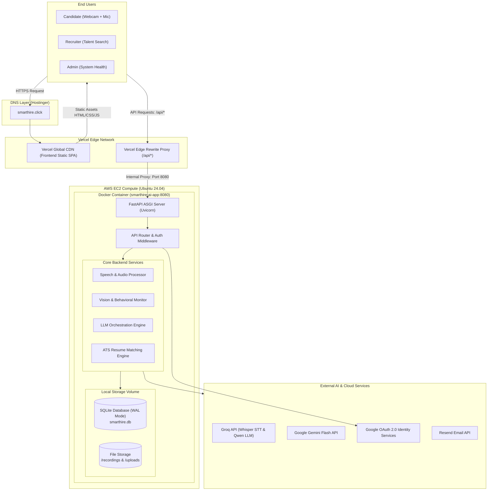
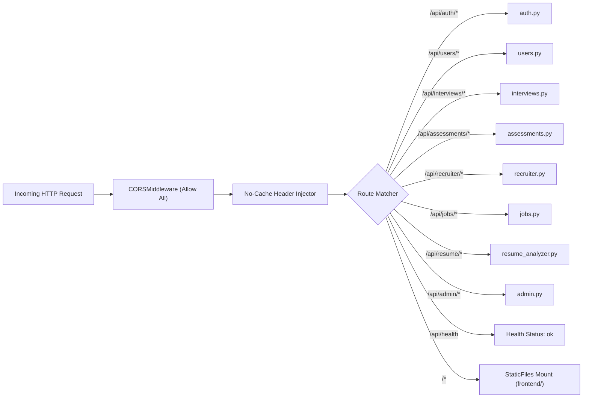
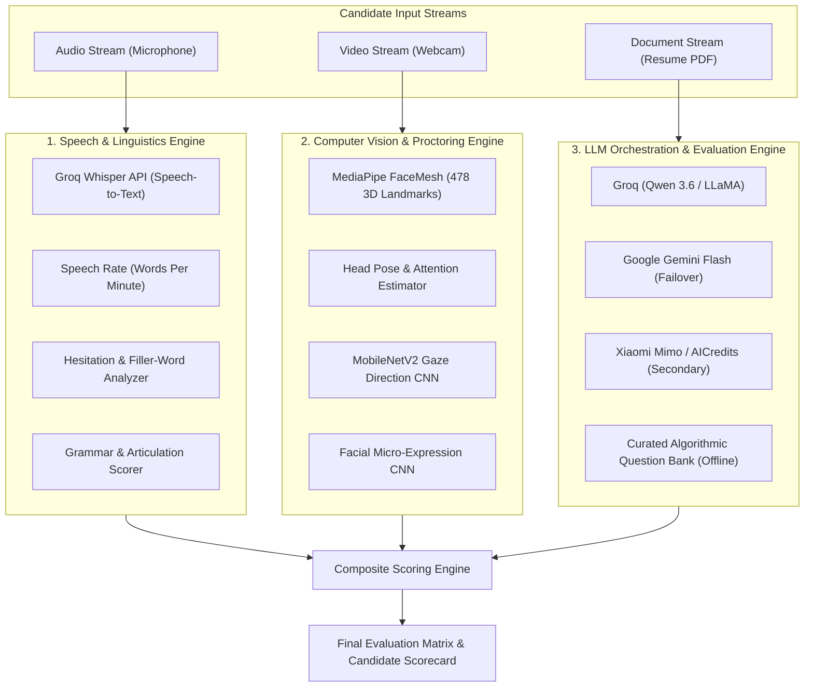
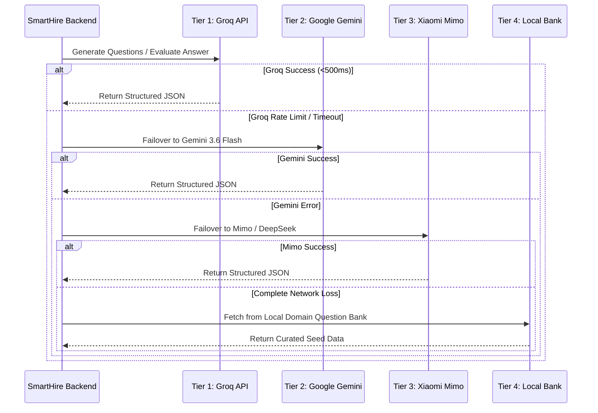
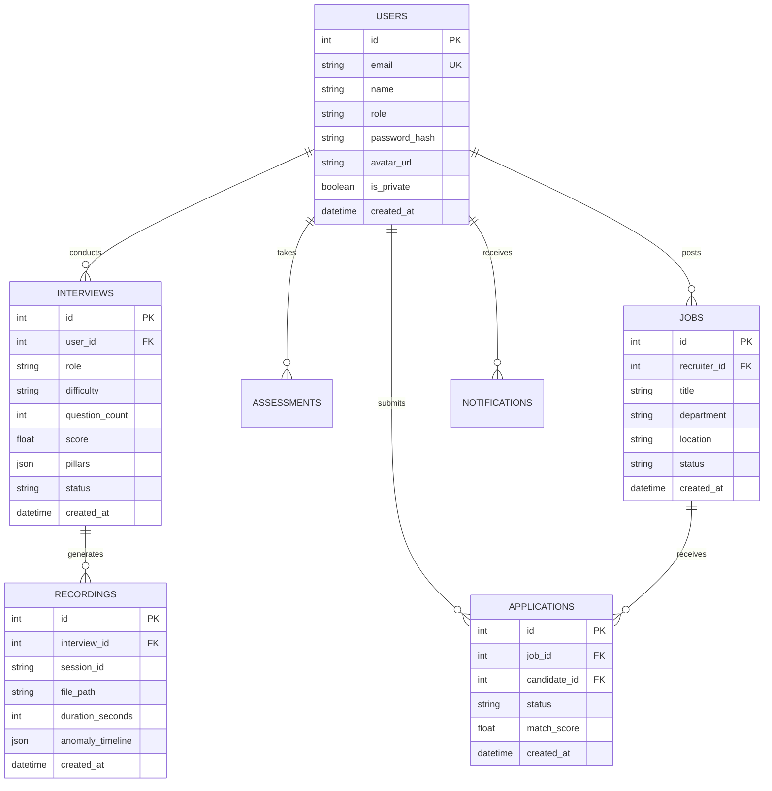

# 🏛️ SmartHire AI — Comprehensive System Architecture & Engineering Design

This document provides an in-depth technical analysis of the system architecture, component design, multi-modal AI pipelines, data models, and deployment infrastructure powering **SmartHire AI**.

---

## 📑 Table of Contents
1. [Architectural Overview & Design Principles](#-architectural-overview--design-principles)
2. [High-Level System Topology](#-high-level-system-topology)
3. [Decoupled Multi-Cloud Deployment Architecture](#-decoupled-multi-cloud-deployment-architecture)
4. [Frontend Client Architecture (SPA)](#-frontend-client-architecture-spa)
5. [Backend API & Gateway Architecture](#-backend-api--gateway-architecture)
6. [Multi-Modal AI & Machine Learning Pipeline](#-multi-modal-ai--machine-learning-pipeline)
   - [Speech & Linguistics Analytics Engine](#1-speech--linguistics-analytics-engine)
   - [Computer Vision & Proctoring Engine](#2-computer-vision--proctoring-engine)
   - [LLM Orchestration & Dynamic Failover](#3-llm-orchestration--dynamic-failover)
7. [Database & Persistence Architecture](#-database--persistence-architecture)
8. [Security, Authentication & Data Privacy](#-security-authentication--data-privacy)

---

## 🎯 Architectural Overview & Design Principles

SmartHire AI is engineered as a **decoupled, multi-modal, cloud-hybrid architecture** built to handle real-time computer vision inference, asynchronous speech-to-text transcription, dynamic LLM generation, and enterprise candidate management.

### Key Architectural Principles:
* **Zero Client-Side Bloat**: Built with vanilla HTML5, modern CSS3 (glassmorphism tokens), and modular ES6 JavaScript without heavy frontend framework dependencies.
* **Edge-Accelerated Delivery**: Static frontend assets are delivered via Vercel's global Anycast Edge CDN, while compute-intensive workloads run in containerized Linux environments.
* **Multi-Tier AI Resilience**: Every AI capability (question generation, speech transcription, resume scoring) implements automatic multi-provider fallback hierarchy (Groq $\rightarrow$ Gemini $\rightarrow$ Mimo $\rightarrow$ Local Heuristics) guaranteeing 99.9% service continuity.
* **ACID Persistence with Fast Write-Ahead Logging**: SQLite in WAL mode delivers sub-millisecond local reads and sequential atomic writes without the overhead of external database servers.

---

## 🌐 High-Level System Topology



---

## 🚀 Decoupled Multi-Cloud Deployment Architecture

SmartHire AI utilizes a distributed deployment pattern that combines the benefits of static edge hosting with dedicated containerized compute:

```
[Hostinger Custom Domain: smarthire.click]
                     │
                     ▼
         [Vercel Edge Network]
         ├── Static Assets (HTML/CSS/JS) ──> Served at Edge
         └── /api/* Requests             ──> Transparent Proxy
                                                   │ (Reverse Proxy)
                                                   ▼
                                    [AWS EC2 Instance: 44.223.11.91]
                                    └── Docker Container (:8080)
                                        ├── FastAPI Application
                                        ├── OpenCV & MediaPipe
                                        └── Persistent EBS Volume
                                            ├── smarthire.db
                                            └── /storage
```

### Component Roles:
1. **Hostinger DNS Zone (`smarthire.click`)**:
   - Manages top-level domain routing via apex `A` records (`216.198.79.1`) pointing directly to Vercel's global ingress.
2. **Vercel Edge Network (`smart-hire-ai-rho.vercel.app`)**:
   - Houses the client application with automated SSL/TLS termination.
   - Configured via `vercel.json` with an edge rewrite rule:
     ```json
     {
       "rewrites": [
         {
           "source": "/api/:match*",
           "destination": "http://44.223.11.91:8080/api/:match*"
         }
       ]
     }
     ```
   - **Advantage**: Completely resolves Cross-Origin Resource Sharing (CORS) and Mixed Content (HTTPS calling HTTP) browser blocks, as the client strictly communicates with `https://smarthire.click/api/...`.
3. **AWS EC2 (`t2.micro` / `t3.micro` - Ubuntu 24.04 LTS)**:
   - Dedicated Linux container runtime managed with `docker-compose.yml`.
   - Configured with a **2 GB Linux swapfile** to comfortably accommodate MediaPipe and OpenCV builds on standard memory profiles.
   - Binds directly to `0.0.0.0:8080` with continuous healthcheck polling via `GET /api/health`.

---

## 💻 Frontend Client Architecture (SPA)

The frontend is architected as a dependency-free, modular **Single-Page Application (SPA)**:

```
frontend/
├── index.html                   # HTML5 Semantic Shell & Fonts Preload
├── assets/                      # SVG Vector Brand Assets
├── css/
│   └── styles.css               # Design System: Glassmorphism, CSS Custom Properties
└── js/
    ├── app.js                   # Application Router, Hash State & View Lifecycle
    ├── core/
    │   ├── api.js               # Centralized Async Fetch Client (Bearer Auth Token)
    │   ├── utils.js             # Shared Components: Modals, PDF Exporter, Toasts
    │   ├── icons.js             # Dynamic Inline SVG Icon Library
    │   └── data.js              # Standardized Thresholds & Benchmark Constants
    ├── telemetry/
    │   └── vision.js            # WebRTC Camera Pipeline & Vision Frame Grabber
    └── modules/
        ├── login.js             # Auth Modal, Google GSI Client, Password Recovery
        ├── candidate.js         # Candidate Cockpit, Mock Arena & Performance Report
        ├── recruiter.js         # ATS Pipeline, Requisitions & Comparison Matrix
        ├── admin.js             # System Telemetry, User Table & Audit Log
        └── settings.js          # Profile Settings, Avatar Cropping & ATS Privacy
```

### Key Frontend Mechanisms:
* **Client-Side Hash Routing**: Navigates seamlessly between views (`#candidate`, `#recruiter`, `#admin`, `#login`) with route guard validation based on decoded JWT roles.
* **Component-Level Modals**: Rendered into dedicated portal roots (`#global-video-modal-portal`) to guarantee proper z-index layering and prevent DOM memory leaks.
* **Vectorized Charting**: Leverages `Chart.js` for dynamic radar percentiles, timeline progressions, and behavioral metric distributions.
* **Client-Side PDF Compilation**: Integrates `jspdf` and `jspdf-autotable` to compile crisp, vector-based candidate scorecards and administrative system health reports in-browser.

---

## ⚙️ Backend API & Gateway Architecture

The backend is built on **FastAPI (Python 3.11)** with an asynchronous ASGI architecture powered by **Uvicorn**:



### Route & Security Middleware Stack:
1. **Lifespan Context Manager**:
   - Executes database schema initialization (`init_db()`) and starts background thread warming for vision models on server startup.
2. **CORS Middleware**:
   - Permits cross-origin requests, credentials, and headers for versatile deployment environments.
3. **Cache-Control Middleware**:
   - Injects `no-cache, no-store, must-revalidate` headers across all API endpoints to guarantee fresh telemetry and report data.
4. **JWT Security Filter**:
   - Validates HS256-signed tokens in the `Authorization: Bearer <token>` header, decoding user ID and verifying role authorization.

---

## 🧠 Multi-Modal AI & Machine Learning Pipeline

SmartHire AI processes human interview interactions through three coordinated multi-modal intelligence engines:



### 1. Speech & Linguistics Analytics Engine
* **Transcription**: Uses **Groq Whisper Large v3** to achieve sub-second speech-to-text accuracy with accurate punctuation and timestamps.
* **Pace Analytics**: Calculates instantaneous and average **Words Per Minute (WPM)**:
  $$\text{Pace Rating} = \begin{cases} \text{Optimal} & 120 \le \text{WPM} \le 160 \\ \text{Rushed} & \text{WPM} > 160 \\ \text{Hesitant} & \text{WPM} < 120 \end{cases}$$
* **Filler Word Detection**: Scans transcript tokens against regex patterns for high-frequency hesitation markers (`um`, `uh`, `like`, `basically`, `you know`, `actually`, `sort of`).

### 2. Computer Vision & Proctoring Engine
* **Facial Landmarks**: Tracks 478 3D facial coordinates using Google's **MediaPipe FaceMesh** in real-time on client video frames.
* **Emotion Classification**: Custom lightweight Convolutional Neural Network (`services/emotion_cnn.py`) processing $48 \times 48$ normalized face crops into four emotional vectors: **Confidence**, **Nervousness**, **Confusion**, and **Neutrality**.
* **Gaze & Attention Tracking**: MobileNetV2-based model (`services/gaze_cnn.py`) estimating eye gaze deviation angles to detect reading from external displays or absence from the camera viewport.

### 3. LLM Orchestration & Dynamic Failover
To guarantee 100% uptime, SmartHire AI implements an automated **cascading failover architecture**:



---

## 💾 Database & Persistence Architecture

SmartHire AI utilizes **SQLite 3** configured with **Write-Ahead Logging (WAL)**:



### Storage Engine Highlights:
* **WAL Mode (`PRAGMA journal_mode=WAL`)**: Allows concurrent reader threads to operate simultaneously without locking writer operations.
* **Volume Mount**: Mounted on the host filesystem at `./backend/data:/app/backend/data`, guaranteeing persistent survival across Docker container rebuilds and host reboots.

---

## 🔒 Security, Authentication & Data Privacy

1. **Password Security**: Passwords are salted and hashed using **Bcrypt (cost factor 12)** via `passlib`. Plaintext passwords never touch disk or logs.
2. **Cryptographic Tokens**: Session authentication relies on signed **JWT tokens (HS256)** expiring after configured intervals.
3. **Candidate ATS Privacy (Stealth Mode)**:
   - Candidates can toggle their profile visibility to Private.
   - When Private, the candidate's profile, contact details, and scores are strictly filtered out of recruiter discovery APIs (`/api/recruiter/candidates`).
   - The candidate's data is only disclosed to a recruiter if the candidate explicitly submits a job application to that specific requisition.
4. **Transparent Reverse Proxy**:
   - The Vercel edge rewrite prevents exposing internal AWS ports to the public web client, shielding the backend against direct port scanning.
